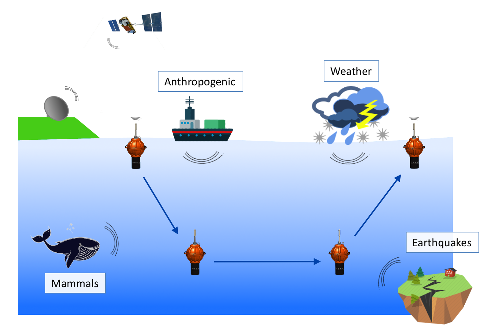

# MeLa Tutorial


1. [What is MeLa?](#whatmela)
2. [List of tutorials](#tutolist)
3. [Installation](#installation)
4. [Directory structure](#directory)
5. [References](#references)
6. [Fundings](#fundings)


## <a name="whatmela"></a> What is MeLa?

MeLa is a language designed for programming Mermaid floats, an instrument used to monitor marine environment by drifting with oceanic currents and diving up to 5000 meters depth at regular time intervals. It is equipped with a hydrophone for pluridisciplinary acoustic monitoring and can be equipped with several other kinds of sensors.



MeLa stands for Mermaid Language. It enables non-specialists of embedded systems to write their own applications for the instrument. This is fulfilled by:

1. hiding embedded software specific codes, such as threads and pointers
2. computing resource limitations of the instrument, such as energy consumption
3. ensuring that the software deployed on the instrument is safe and reliable
4. enabling several applications to be deployed on the same instrument

<!--MeLa applications can be executed on a personal computer. Since the language is compiled into C code, the processing is fast. Even if the purpose of personal computer execution is verification before deployment on a float, MeLa can also be a good choice for processing data on a laptop.-->


## <a name="tutolist"></a> Tutorials list

There are two tutorials to demonstrate some of the capabilities of MeLa. These tutorials are based on real study cases but are simplified to remain didactic.

1. [Seismic detection tutorial](seismic/README.md)
2. [Fin whales detection tutorial](fin-whales/README.md)

MeLa is still evolving, any suggestions to improve the language is welcome.

Data to run the simulations are included in the repositories, under each simulation/input directory.


## <a name="installation"></a> Installation

1. MeLa has been tested only on:
	* **Linux** 
	* **macOS**
<!--	* (still **not** tested on Windows) -->

2. Install the Atom editor:
	* [https://atom.io/](https://atom.io/)

3. Install the MeLa package in Atom:
	* [https://atom.io/packages/mela](https://atom.io/packages/mela).

4. Running simulations on your computer also require to install:
	* CMake:
		* [https://cmake.org/](https://cmake.org/)
	* A compiler:
		* For Linux install the build-essential package with:
			* `sudo apt update`
			* `sudo apt install build-essential`.
		* For macOS install the Xcode Command Line Tools with:
			* `xcode-select --install`


## <a name="directory"></a> Directory structure

Each MeLa project must follow, at minima, the following structure. Other files and folders can be added without affecting the project, but these folders `simulation/input` and`simulation/output` exist to execute the applications `app.mela` on your personal computer. 

```
project
│   app.mela  // Contains the MeLa application of name 'app'
│
└───simulation  //  Directory for executing `app.mela` on your personnal computer 
│   │   postProcessing.sh  // Shell script for post processing such as plotting
│   │
│   └───input // Must contain results of simulation such as 'data1.bin.out'  
│   │   │   data1.bin
│   │   │   ...
│   │
│   └───ouput // Will contain results of simulation such as 'data1.bin.out' 
│   │   │   ...
```


## <a name="references"></a> References

MeLa reference manual:

* TODO


Publications about MeLa:

* Bonnieux, S., Cazau, D., Mosser, S., Blay-Fornarino, M., Hello, Y., & Nolet, G. (2020). MeLa: A Programming Language for a New Multidisciplinary Oceanographic Float. Sensors, 20(21), 6081. doi: [10.3390/s20216081](https://doi.org/10.3390/s20216081)


Publications about the Mermaid instrument:

* Simons, F. J., Nolet, G., Georgief, P., Babcock, J. M., Regier, L. A., & Davis, R. E. (2009). On the potential of recording earthquakes for global seismic tomography by low-cost autonomous instruments in the oceans. J. Geophys. Res. Solid Earth, 114(B5). doi: [10.1029/2008JB006088](https://doi.org/10.1029/2008JB006088)
* Sukhovich, A., Bonnieux, S., Hello, Y., Irisson, J.-O., Simons, F. J., & Nolet, G. (2015). Seismic monitoring in the oceans by autonomous floats - Nature Communications. Nat. Commun., 6(8027), 1–6. doi: [10.1038/ncomms9027](https://doi.org/10.1038/ncomms9027)
* Hello, Y., & Nolet, G. (2020). Floating Seismographs (MERMAIDS). Encyclopedia of Solid Earth Geophysics. Springer. doi: [10.1007/978-3-030-10475-7_248-1](https://doi.org/10.1007/978-3-030-10475-7_248-1)


Publications about Mermaid data:

* Nolet, G., Hello, Y., Lee, S. v. d., Bonnieux, S., Ruiz, M. C., Pazmino, N. A., Deschamps, A., Regnier, M., Font, Y., Chen, Y. J., Simons, F. J. (2019). Imaging the Galápagos mantle plume with an unconventional application of floating seismometers - Scientific Reports. Sci. Rep., 9(1326), 1–12. doi: [10.1038/s41598-018-36835-w](https://doi.org/10.1038/s41598-018-36835-w)
* Pipatprathanporn, S., & Simons, F. J. (2021). One year of sound recorded by a mermaid float in the Pacific: hydroacoustic earthquake signals and infrasonic ambient noise. Geophys. J. Int., 228(1), 193–212. doi: [10.1093/gji/ggab296](https://doi.org/10.1093/gji/ggab296)
* Simon, J. D., Simons, F. J., & Irving, J. C. E. (2021). Recording earthquakes for tomographic imaging of the mantle beneath the South Pacific by autonomous MERMAID floats. Geophys. J. Int., 228(1), 147–170. doi: [10.1093/gji/ggab271](https://doi.org/10.1093/gji/ggab271)


## <a name="fundings"></a> Fundings

This work is the result of a collaboration between two research laboratories and a company:

* [Géoazur](https://geoazur.oca.eu/)

* [I3S](https://www.i3s.unice.fr/)

* [OSEAN S.A.S](https://www.osean.fr/)


It has been funded by:

* [Institut de Recherche pour le Développement](https://www.ird.fr/)

* [University of Côte d'Azur](https://univ-cotedazur.fr/)

* [Emplois jeunes doctorants by Région Sud](https://www.maregionsud.fr/aides-et-appels-a-projets/detail/emplois-jeunes-doctorants)

* [OSEAN S.A.S](https://www.osean.fr/)


