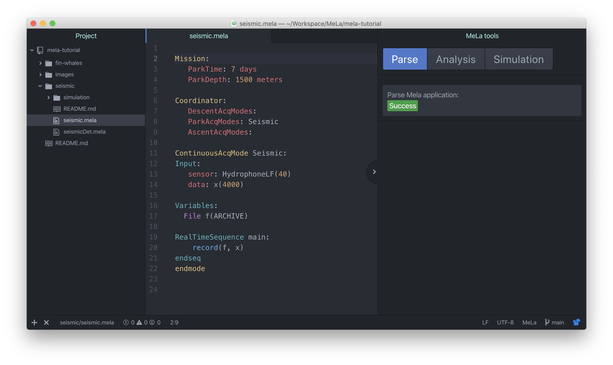
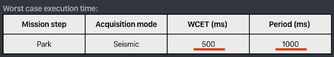
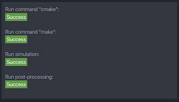
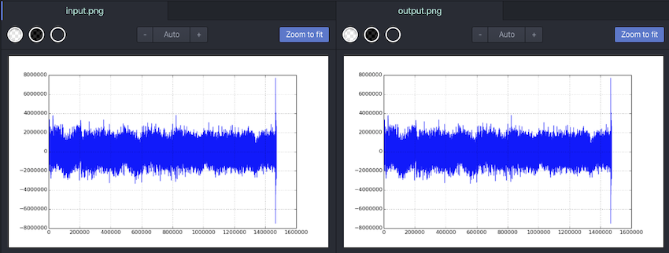
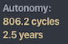
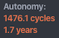
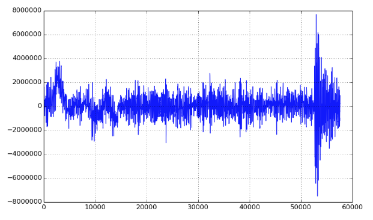
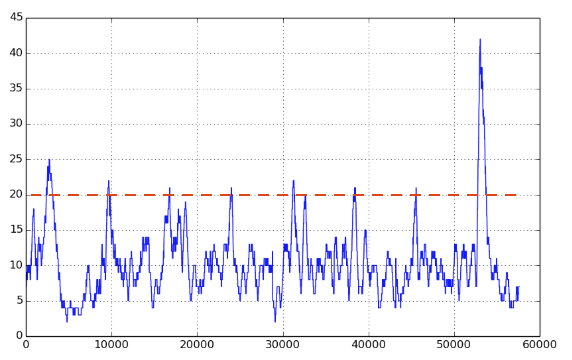
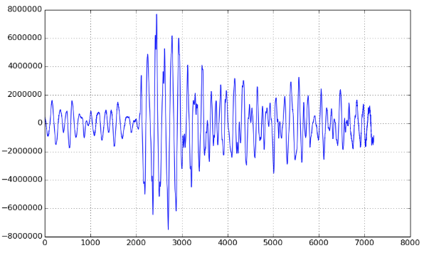
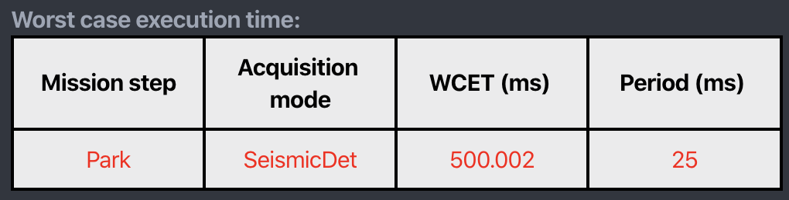

# MeLa seismic tutorial

In this tutorial we write an application to record seismic noise in the oceans with the Mermaid float.


## 1. Setup

Download the `mela-tutorial` project and open it in Atom with `file -> open` and select the directory `mela-tutorial` to open the whole project.

If you do not have installed MeLa, follow the guide in the root directory [README.md](../README.md).

In the Atom project panel, on the left, open the file `seismic/seismic.mela`.

Activate the MeLa package with the keyboard shortcut `ctrl-alt-m`, through the menu `Packages -> MeLa -> toogle` or with the Atom command palette.

You should have the following interface, with the directory browser on the left pane, the file editor in the center pane and the MeLa tools on the right pane:


<!-- 

-->


## 2. Interface presentation

The MeLa interface is made up of three tabs:

* The **Parse** tab in which a MeLa source file is interpereted. This tab will show syntax errors, problems with names of variables or with length of arrays, etc.

* The **Analysis** tab in which is verified that the limits of the instrument are not exceeded. There are different tables about processor usage, energy consumption and satellite transmission:

   1. The *Mean processor utilization rate* table represents the mean amount of processor time used by applications.

   2. The *Worst-case processor utilization rate* table represents the worst amount of processor time used by each application. This information is necessary to ensure the proper behavior of applications in real time. 

   3. The *Worst-case execution time* table represents the worst execution time of an application compared to its period of execution, compared  it can help to understand an error.

   4. The *Autonomy* part gives an estimation of the battery lifetime of the instrument in terms of  a number of cycles and years.
   
   5. The *Energy consumption rate* table details the amount of energy spent by the different components of the instrument in order to help to understand what is causing power consumption.
   
   6. The *Satellite transmission* part gives an estimation of the quantity of data transmitted for each cycle and per month, and an estimation of the cost, in euros, per month.

* The **Simulation** tab in which you can execute an application on your personal computer. You can choose the input and output directory for data to process and also a post-processing script.


## 3. Continuous record

### a. Description of the application

The `seismic.mela` file contains an application to continuously record seismic sound.

The MeLa application is made of the following parts:

* In the `Mission:` part we defines the dives depth and duration to 1500 meters and 7 days.

* In the `Coordinator:` part we chose to activate the recording application during the park (e.g., when the float is stabilized at 1500 meters).

* The acquisition part called `ContinuousAcqMode Seismic:` contains:
	* the `Input` with the sensor name and sampling frequency `sensor: HydrophoneLF(40)` and the variable name and size which contains input data `data: x(40)`.

	* The `Variables` part contains the declaration of variables, here a file called f in which all data will be recorded  `File f(ARCHIVE)`.

	* The `RealTimeSequence` part contains the `record` function, which is called each time the input variable is filled with new data from the sensor.

```
Mission:
   ParkTime: 7 days
   ParkDepth: 1500 meters

Coordinator:
   DescentAcqModes:
   ParkAcqModes: Seismic
   AscentAcqModes:

ContinuousAcqMode Seismic:
Input:
   sensor: HydrophoneLF(40)
   data: x(40)

Variables:
  File f(ARCHIVE)

RealTimeSequence main:
    f.record(x)
endseq
endmode
```


### b. Improving battery lifetime

In the analysis tab, a warning is raised because the autonomy is estimated to be less than 4 years.

In the *Energy consumption rate* table, you can see that 46.3 % of the energy is consumed by the processor. This is due to the recording of data. that use half of the processor time. You can see in the *Worst case execution time* table, that the execution time of the recording function (the only one in the application) is 500 ms and is called every 1 second.



In this case, a way to reduce processor usage is to increase the period of execution.

Increase the size of the input variables so that the recording function is called much less frequently. With `data: x(4000)` the recording function will be called once every 100 seconds, reducing the processor utilization rate to 0.5% and thus it's contribution to energy consumption to 5%.

The recording function is particular because its execution time is (almost) constant whatever the amount of data to record, thus it is more efficient to record bigger packets of data. The same principle applies when coping files on a USB key, a big archive file is much faster to copy than a lot of small files.

For other functions, like filters, it is more likely that the execution time increase propotionnaly to input data size.  


### c. Simulation

Go in the simulation tab to launch the program. This part requires that you have installed CMake and a compiler such as gcc (see [installation guide](../README.md)).

Be sure that the post-processing checkbox is checked. The post-processing is called after the processing done by the MeLa application.

The post-processing program is called from the shell file `simulation/postprocessing.sh`. In this case, we call the python script `plot.py`. This python script requires numpy and matplotlib to be installed. You can use a conda environment by uncommenting the 3 lines in the script and putting a valid name instead of `yourCondaEnvName` (do not uncomment `#!/bin/bash`).

Click on the `Run` button. All steps of the simulation should be green.




Once the processing is finished, go in the `Simulation` directory (in the left panel) and compare the `input.png` and `output.png` files, both should contain exactly the same signal since we are only doing a recording.



The `input` directory contains the input files for the simulation.  All files in the directory with a `.bin` extension will be processed. For the moment, the files must be in a binary format. An example of script for formatting data can be found in the `preprocessing` directory.

<!-- We expect to handle sac, mseed, and wave files in the next future. -->


### c. Try other configurations

Reducing the park time to 7 hours reduce the autonomy of the float from 5.9 years to 2.5 years. In the energy consumption rate table, the total actuators contributions pass from 30% to 90%. This is normal since the actuators use a lot of energy for each ascent.



If the park time is kept to 7 hours and the depth 150 meters, the autonomy is reduced again to 1.7 years. Indeed, at this depth the float is capable of doing more cycles which reach 1476, but with a shorter descent and ascent time.



Now set the application to send the data through satellite communication by changing `File f(ARCHIVE)` to `File f(TRANSMIT)`. This time the estimated lifetime of the float drop to 0.2 years because we are trying to transmit too much data. We will overcome this with a detection algorithm in the next part of this tutorial.


## 4. Seismic detection

### a. Description of the application

The signal used for the simulation contains a seismic signal at its very end and we want to record only this part of the signal. The detection algorithm implemented in this section is a Short Term Average over Long Term Average (STA/LTA) with a triggering function to record the signal for satellite transmission.

Open the `seismicDet.mela` file which contains the whole application. We describe here the different parts of this application.

The mission is still 7 days and the detection algorithm is only run during the park phase (see `Coordinator` part).

```
Mission:
   ParkTime: 7 days
   ParkDepth: 1500 meters

Coordinator:
   DescentAcqModes:
   ParkAcqModes: SeismicDet
   AscentAcqModes:
```


In the acquisition mode, the input sensor is set to a sampling frequency of 40 Hz and the input variable size is set to 40, thus the data will be processed every second.

```
ContinuousAcqMode SeismicDet:
Input:
   sensor: HydrophoneLF(40)
   data: x(40)
```


The instruction `last3Minutes.push(x)` save the last 3 minutes of data in a buffer. This is the signal that we will send through satellite communication. 

```
Variables:
  // Save last 3 minutes of data in a buffer (40 Hz * 180 s = 7200 samples)
  BufferInt last3Minutes(7200)

RealTimeSequence trigger:
   last3Minutes.push(x)
```


The next instructions are computing the Short Term Average over Long Term Average.

```
x = abs(x)
/* A short term average of 400 samples over long terme average of 4000 samples
Offset between STA and LTA is set to 0 */
x = stalta(x, 400, 4000, 0)
```


The trigger instruction set the `trig` variable to `True` two minutes after the result of the STA/LTA pass over 2 (the point in `2.` defines a float).

```
/* Triggering 2 minutes (4800 samples) after the result of the STA/LTA pass over 2 */
trig = trigger(x, RISING_EDGE, 2., 4800, 0)
```


The record function is called in the `if` block. The probability line allows the programmer to define an estimation of probability , or periodicity, to enter in the `if` block. In the case we estimate that we will record 1 seismic signal each month. If you change the probability to `@probability 1 per hour` you will drastically decrease the autonomy and increase the satellite transmission cost. Setback the probability value to `1 per week`.

```
Variables:
  // File to record the data
  File f(TRANSMIT)

RealTimeSequence trigger:
   ...
   if trig:
      @probability 1 per week
      f.record(last3Minutes)
   endif
```


### b. Settle the detection level

Go to the simulation panel and click on the `Run` button. Check at the results in the `simulation/output.png` file. You can see that more than three minutes of signal is recorded whereas there is only one seismic in the data.




Move the `last3Minutes.push(x)` after the `stalta` function call to record the result of STA/LTA and run the simulation again. In the output plot, you can see that the level of the STA/LTA pass several times above 20. 




To trigger only on the seismic signal at the end of the file, the trigger level must be b etween 3 and 4. We choose an intermediate value of 3.5 in the `stalta` function. If you run the simulation again, the seismic signal will be the only one recorded.




### c. Introduction to processing sequence


Let's consider that you want to process each sample one after the other (instead of processing packets of 40 samples). To do so, change the length of the input variable `x` to 1.

An error is raised because the recording function with an execution time of 500 ms is above the period of acquisition of 25 ms (the acquisition rate is still set to 40 Hz). This means that samples will not be processed during 500 ms and it can also have consequences for other applications running at the same time on the MERMAID float.




Missing some data after a seismic detection is not a problem for our application. In order to remove the error, we must explicitly allow for the suspension of the acquisition.

This can be done with a processing sequence. Any function called inside a processing sequence is executed in the background, such that it will not interfere with the smooth running of other applications.

If you add a `ProcessingSequence` and call it in the `if`, such as shown below, it tells MeLa to execute it in the background and the error will disappear.

```
RealTimeSequence trigger:
   ...
   if trig:
      @probability 1 per week
      call record
   endif
endseq

ProcessingSequence record:
    record(f, last3Minutes)
endseq
```


**A generic rule to remember in case of error raised due to high processor usage is that functions called sparsely and requiring a lot of processing time should be put in a processing sequence.**


<!--
### d. Going further

If you want to develop further the detection algorithm, you can download a full dataset with annotation of earthquakes on this website:

TODO


## 5. Background seismic noise monitoring

TODO 


## 5. Put the three applications together

TODO 
-->
