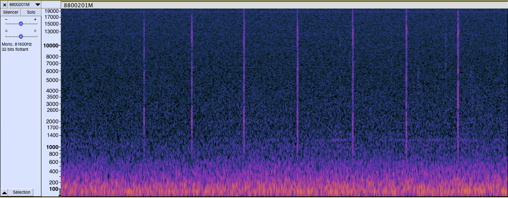
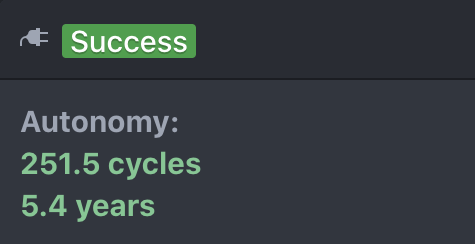
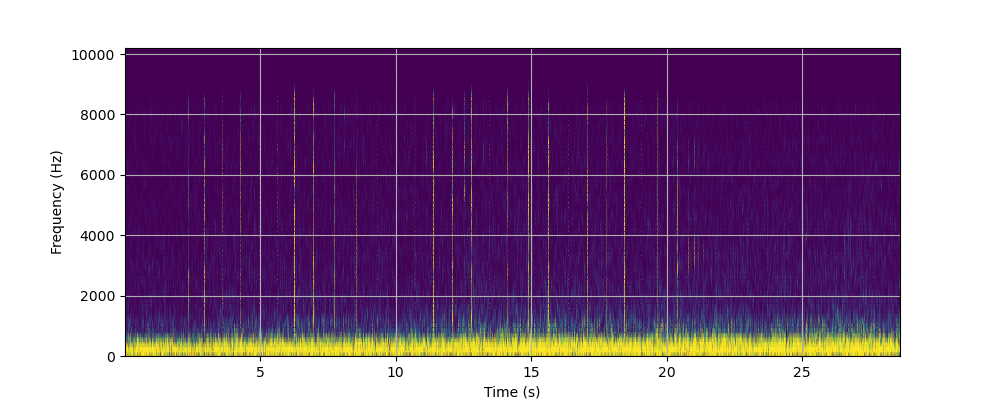
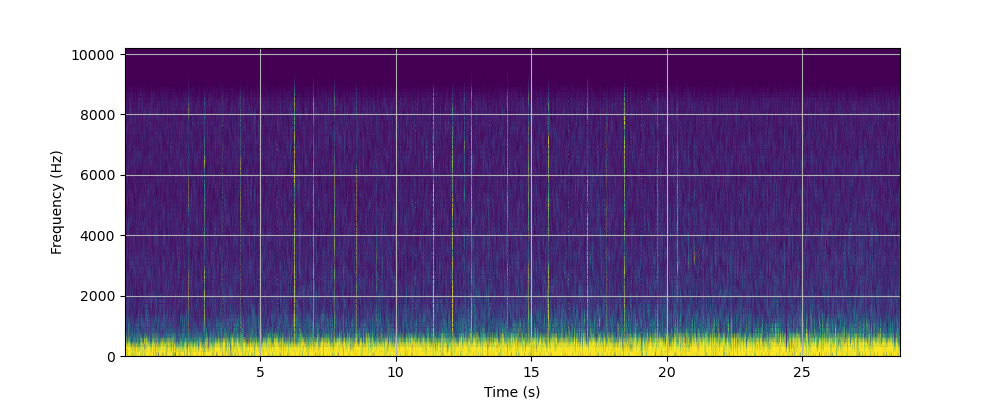
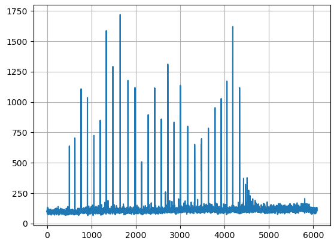
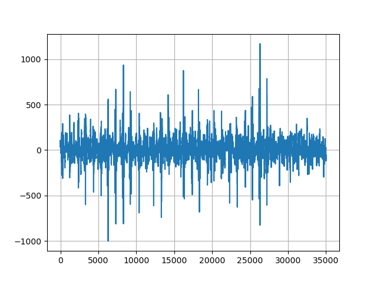
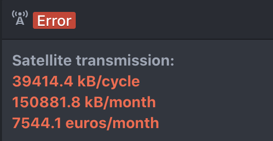
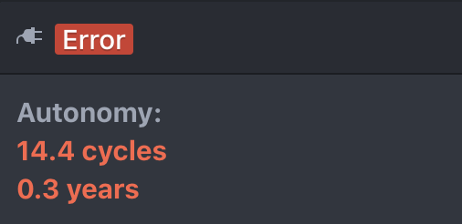

# Sperm whales tutorial

In this tutorial we write an application for the detection of sperm whales clicks.


## 1. Prerequisites

The Mela language must be installed in Atom, the procedure is descibed in [README.md](../README.md).

If your not familiar with MeLa, it is recommended to start with the seimic detection tutorial [README.md](../seismic/README.md).


## 2. Data analysis

The sample in the `simulation/preprocessing` directory and used to test this application is from the Watkins Marine Mammal Sound Database. It is the *Ligurian Sea, NW Italy 	22-JUL-1988* sample that can be downloaded at:
[https://cis.whoi.edu/science/B/whalesounds/bestOf.cfm?code=BA2A](https://cis.whoi.edu/science/B/whalesounds/bestOf.cfm?code=BA2A).

You can listen the `8800201M.wav` file and plot a spectrogram with a software such as Audacity. The figure below shows a zoom of the spectrogram, the clicks are clearly visibles as the vertical lines between 1 and 10 kHz and have a width of 25 ms.




## 3. Developping the application

### a. Compute spectrum

The `spermWhales.mela` file contains an application that get high frequency hydrophone data. The sampling frequency is 20 kHz and data are processed by packets of 128 samples (6.4 ms) and an overlap of 32 samples (1.6 ms). The mean value of the spectrum between 1 kHz to 10 kHz is computed for each data packet, this value will be used later to trigger the recording of a signal.

```
Mission:
   ParkTime: 7 days
   ParkDepth: 1500 meters

Coordinator:
   ParkAcqModes: spermWhales

ContinuousAcqMode spermWhales:
Input:
   // Use the high frequency hydrophone with sampling frequency of 20 kHz
   sensor: HydrophoneHF(20000)
   // Get packets of 128 samples
   data: x(128)
   // Set overlap of 32 samples
   overlap: 32

Variables:
   // An array to process the acoustic data 
   Array spectrum(128)
   // Measured level
   Float level
   
RealTimeSequence main:
   // Compute FFT of length 128 with a hanning windows
   spectrum = fft(x, 128, HANNING)
   // Compute the mean level of the signal from 1 kHz to 10 kHz
   level = mean(spectrum[7:64])
endseq;
endmode;
```

### b. Performance optisation

For this application the estimated autonomy is 3.2 years. The processor and sensor power consumption are estimated to be responsible of more than 80 % of the total power consumption. In order to reduce power consuption we can setup the application to be executed only half of the time.

In the `Coordinator` part set up an execution period for the application:
```
Coordinator:
   ParkAcqModes: spermWhales during 30 minutes every 1 hour
```

With this configuration the estimated autonomy increase to 5.4 years.



Reducing overlap length to 0 improve autonomy to 5.8 years, and decreasing sampling frequency to 10 kHz improves it again to 6.6 years. This additional gain is obtain thanks to the processor usage decreasing from 40 % to 15 %, such that processor impact to energy consumption decrease from 32 % to 18 %. However those improvements of autonomy could also affect the efficiency of the algorithm, and we decide to keep an overlap of 32 samples and a sampling frequency of 20 kHz.

We can also try to act on the FFT length, but increasing it will decrease autonomy because processing time is not directly proportional to FFT length (for the processor used in the Mermaid float), and decreasing it will not improve autonomy.


### b. Ploting the spectrogram

Before to be processed by the MeLa application, the `.wav` file must be downsampled at 20 kHz and converted in a binary file of floats numbers, wich is the default format of data on the Mermaid instrument. The conversion script is in the `simulation/preprocessing` directory and the converted file `8800201M.wav.bin` have already been copied into the `simulation/input` directory for the simulation.

In the MeLa application, declare a file and record the spectum:

```
Variables:
   ...
   //File to record spectrum
   File fspectrum(ARCHIVE)
   
RealTimeSequence main:
   ...
   // Record spectrum without symetric part
   fspectrum.record(spectrum[0:65])
```

The analysis reports an error because, 

In the `Simulation` tab, clic on the `Run` button to execute the application and the ploting script.

The ploting script is in the flie `simulation/plot.py` and is called from `postprocessing.sh` that must be edited in function of your python environment, as described in the seismic application.

The ploting script generate two spectrograms, the first is computed with the python module scipy, the second is computed by MeLa. Both are pretty similar, even if the background noise is higher with MeLa (the diffrence could come from computing methods and precision).






### c. Ploting the mean level

Edit the MeLa application to record the mean level.

```
Variables:
   ...
   // File to record level
   File flevel(ARCHIVE)
   
RealTimeSequence main:
   ...
   // Record level
   flevel.record(level)
```

Open the `plot.py` file and uncomment the `plot_mean_level()` function call.

```
# plot_spectrogram()
plot_mean_level()
```

The result shows a signal with spikes corresponding to clicks. 




### d. Adding the detection part

We can now add the detection to record 50 ms of signal and the sample index of each detection (which is equivalent to record a date).

The code to add is the following, but if you are lazy, the complete code can also be found in the file `spermWhales-final.mela`.

In this code we added:

1. A buffer to keep 50 ms of signal in memory.
2. A trigger function that is activated 40 ms after a spike.
3. A condition to call recording functions, we suppose that the condition will be true around one time per minutes. 
4. A `ProcessingSequence` to record samples index of spike and the last 50 ms of signal.

```
Variables:
   ...
   // A buffer to record the acoustic data of the last 50 ms
   Buffer last50ms(1000)
   // Trigger
   Bool trig
   // Sample index when trigger is activated
   Int sampleIndex
   // Files to record sample index and last 50 ms of data
   File fsampleIndex(TRANSMIT), flast50ms(ARCHIVE)
 
RealTimeSequence main:
   ...
   // Push last data into buffer without overlaping part of 32 samples
   last50ms.push(x[0:95])
   // Trigger when the signal pass over 250 and after a delay of 8 packets of data (40 ms)
   trig = trigger(level, RISING_EDGE, 250., 8, 0)
   if trig:
      @probability 1 per minute
      call record  
   endif
 endseq;
   
 ProcessingSequence record:
   sampleIndex = getSampleIndex()
   fsampleIndex.record(sampleIndex)
   flast50ms.record(last50ms)
endseq;
```

You can notice that the estimated autonomy decrease a little to 5.2 years and that the satelitte transmission is estimated to be 150 kB per month.


To plot the result, open the `plot.py` file, uncomment the line, and click on the Run button.

```
plot_recorded_clicks()
```

The timestamps will be showed in the interface and you will obtain a plot showing the recorded pulses.




In this code the 50 ms of data are recorded ont he float for a later recovery. To see what happend if these data are transmitted by satelitte, replace the `flast50ms(ARCHIVE)` by `flast50ms(TRANSMIT)`. In that case, the amount of transmission per cycle is 39 MB which is way too much for the satelitte transmission capability of the float, the consecutive coost become 7544 euros per month and autonomy decrease to 4 months only.







<!--

## 3. Todo: Temporal appproach

High pass filter with STA/LTA

-->


